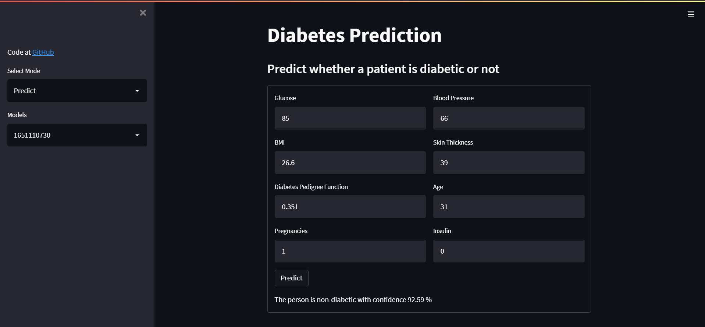
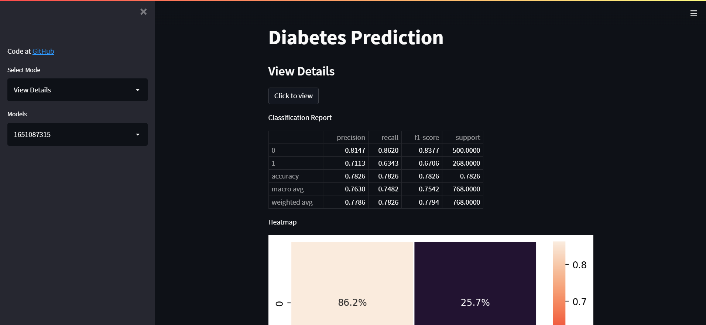
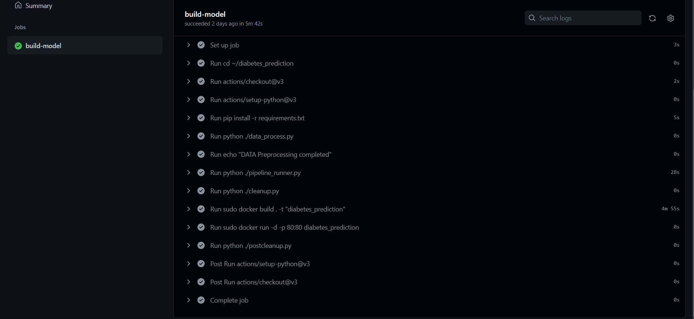

# Devops for AI (Diabetes prediction model automated pipeline)

## Live Demo of website: [http://20.205.107.106/](http://20.205.107.106/)
### Prediction from model

### Visualization of model performance

## Tools Used
- Model Training: Tensorflow
- Model testing and evaluation: Tensorflow-extended
- Model deployment: Streamlit
- Deployment environment setup and configuration: Docker
- Version control: Git and Github
- Pipeline Management: Github actions

## Pipeline flow
- Runs on every push to the repository
- Automated Flow
    - 1. Preprocess the dataset uploaded in data folder
    - 2. Train the model on the preprocessed dataset
    - 3. Test the model
    - 4. Save the model and give it the unique label
    - 5. Deploy the web app

## How pipeline flow works
On every push to the repository, the pipeline detects the change and run the steps to update the model and then deploys the model for use on the web automatically.

